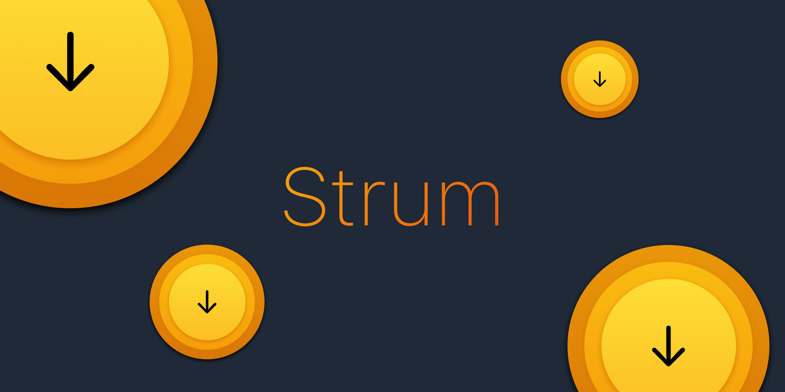
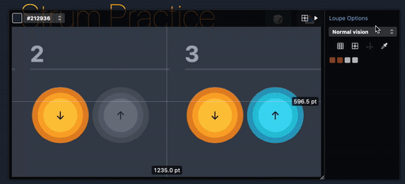

# Strum



[](https://app.netlify.com/sites/fervent-leakey-947339/deploys)

<https://strum.bsteph.com>

Based on strumming exercise seen in this [video by JustinGuitar](https://www.youtube.com/watch?v=CjM5fyXoV8w)

## 💾 Installation

1. `nvm use`
2. `npm install`
3. `npm start`
4. <http://localhost:8081>

## 🖥 Commands

### dev

1. `npm start`
2. <http://localhost:8081>

### build

Build production version of the site.

1. `npm run build`
2. output goes to `./dist`

### serve

Serve the `./dist` directory.

1. `npm run serve`
2. <http://localhost:3000>

### clean

Delete the `./dist` folder and `./src/styles/`.

1. `npm run clean`

## Notes on build process

**Dev**

1. Gulp runs PostCSS to build Tailwind to `./src/styles.css`
2. Eleventy runs and links to css at `./src/styles.css`
3. Gulp watches for changes to `.src/postcss/`
4. Eleventy watches for changes to lots of files including the output of gulp css to `.src/styles`

**Production**

1. CSS is built via PostCSS in production mode (which purges unused Tailwind classes) via Gulp
2. Then Eleventy runs in production mode
3. Gulp inlines and minifys CSS, JS, HTML from the eleventy output

## ♿️ Accessibility

- [Lighthouse](https://developers.google.com/speed/pagespeed/insights/?url=https%3A%2F%2Fstrum.bsteph.com)
- [Web accessibility evaluation tool](https://wave.webaim.org/report#/https://strum.bsteph.com)

**Note on viewport**  
To get 100% on accessibility under the Lighthouse metric you need to update the `viewport` meta tag to be:

```
<meta name="viewport" content="width=device-width, minimum-scale=1, maximum-scale=5" />
```

I've chosen not to do this as it causes the site to zoom in frequently while tapping the UI.

**Note on colors**  
Special care was taken to pick colors that worked well for various forms of color blindness. [xScope](https://xscopeapp.com) was used to preview colors using the loupe tool.



## 📚 References

- [eleventy](https://www.11ty.dev)
- [tailwind css](https://tailwindcss.com)
- [gulp](https://gulpjs.com)
- [liquid](https://liquidjs.com)
- [nvm](https://github.com/nvm-sh/nvm)

## 👾 Icons

Icons and hero image made using [Figma](https://www.figma.com).

[Strum Design Document](https://www.figma.com/file/oIxMenFdF5HbySnAazHw0D/Strum?node-id=0%3A1)

## 🌎 Hosting

- CI & Hosting on [Netlify](https://www.netlify.com).
- [GoSquared](https://www.gosquared.com) analytics added as post processing step in Netlify.

## 🗺 Roadmap

- [x] tailwind setup
- [x] prettier setup
- [x] deploy to the world
- [x] some sort of templating
- [x] allow toggle of strum pattern
- [x] add query params for loading specific patterns
- [x] shuffle button for random strum patterns
- [x] add screen reader friendly labels to buttons
- [x] pick out better colorblind friendly colors/contrasts
- [x] BUG anchors broken
- [x] BUG active state is stuck on touch devices
- [x] add apple touch icon
- [x] add favicon
- [x] add a share button
- [x] try inline css for speed
- [x] change the statusbar color on iOS
- [x] make pwa (removed didnt like)
- [x] dark/light modes
- [x] more reliable watch/serve in dev mode
- [x] add support for multiple time signatures
- [x] add some sort of buy me a beer/coffee/tea button
- [x] make repo public

---

If you find this project useful you can donate:

[](https://ko-fi.com/G2G33AMQO)
